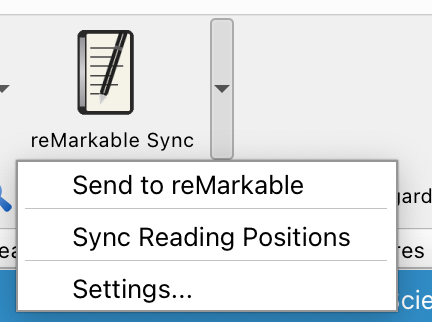
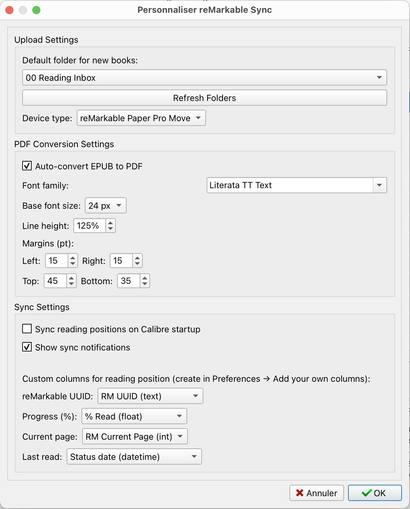

# reMarkable Sync - Calibre Plugin

A Calibre plugin for synchronizing e-books with reMarkable tablets (Paper Pro Move and other models) via the reMarkable desktop app.

<p align="center">
  
</p>

## Features

- Send books from Calibre library to reMarkable tablet
- Export selected books as reMarkable-tuned PDFs to any folder (no device required)
- Automatic EPUB to PDF conversion with configurable font, size, line height, and margins
- Device-specific page sizes (reMarkable 2, Paper Pro, Paper Pro Move)
- Full-bleed cover pages (no margins, optimized for e-ink display)
- Select destination folder on reMarkable
- Sync reading positions back to Calibre (progress, page, last read)
- Document naming: "Series-Number Title - Author" for easy organization

> **Platform support**: Developed and tested on **macOS**. The plugin
> uses Calibre's cross-platform APIs and has code paths for Windows and
> Linux, but those are currently **untested** — feedback welcome.

## How syncing works

This plugin does **not** talk to the reMarkable cloud or to the tablet
directly. It writes books into the local storage of the **reMarkable
desktop app**, which then uploads them to your tablet on its next sync.

That means you need to:

1. Have the [reMarkable desktop app](https://remarkable.com/desktop)
   installed and logged in to your reMarkable account.
2. **Quit and restart the reMarkable desktop app after sending books.**
   The app only picks up new documents at startup; without a restart,
   nothing reaches the tablet.

## Prerequisites

- [Calibre](https://calibre-ebook.com/) 5.0.0 or later
- [reMarkable desktop app](https://remarkable.com/desktop) installed and logged in (required — see above)
- Python 3 (bundled with Calibre)

### Optional (for PDF page counting)

The plugin uses multiple fallback methods for PDF page detection. Install any of these for better reliability:

- `poppler-utils` (provides `pdfinfo`) - recommended
- `PyPDF2` Python library
- `pikepdf` Python library
- `qpdf` command-line tool

## Installation

1. Go to the [latest release](https://github.com/mremond/calibre-remarkable/releases/latest)
   and download the `remarkable_sync-X.Y.Z.zip` asset under **Assets**.

   > ⚠️ Do **not** download "Source code (zip)" or
   > "Source code (tar.gz)". Those are auto-generated by GitHub, wrap
   > everything inside a top-level folder, and Calibre will refuse to
   > load them.
2. In Calibre, go to **Preferences → Plugins → Load plugin from file**
   and select the downloaded zip.
3. Restart Calibre. The plugin appears as **reMarkable Sync** in the
   toolbar and under **Tools**.
4. Open **Tools → reMarkable Sync → Settings…** to configure your
   default folder, device type, conversion preferences, and (optionally)
   custom columns for reading-position sync.

## Example output

Curious what the conversion looks like before installing? See
[`examples/the-time-machine.pdf`](examples/the-time-machine.pdf) — *The
Time Machine* by H. G. Wells, sourced from
[Standard Ebooks](https://standardebooks.org/ebooks/h-g-wells/the-time-machine)
and converted with the plugin's default settings for the **reMarkable
Paper Pro Move** (full-bleed cover, configured typography and margins).

## Development Setup

### Project Structure

```
remarkable-sync/
├── __init__.py      # Plugin entry point (InterfaceActionBase)
├── ui.py            # Menu actions and user interface
├── main.py          # Book path utilities
├── worker.py        # Conversion and sending logic (runs in background)
├── remarkable.py    # reMarkable file format handling
├── config.py        # Settings UI and preferences
├── images/          # Plugin icons
└── Makefile         # Development commands
```

### Installation for Development

```bash
# Using Makefile (macOS)
make install    # Install plugin
make run        # Launch Calibre
make dev        # Install + run

# Or directly with calibre-customize
calibre-customize -b .
```

After installation, restart Calibre to load the plugin.

### Running with Debug Output

```bash
# macOS
/Applications/calibre.app/Contents/MacOS/calibre --debug

# Windows/Linux
calibre --debug
```

Debug output appears in the terminal, useful for troubleshooting plugin issues.

### Development Workflow

1. Make changes to plugin source files
2. Run `calibre-customize -b .` to reinstall
3. Restart Calibre (or use the debug console to reload)
4. Test via **Tools → reMarkable Sync → Send to reMarkable**

### Accessing Plugin Settings

**Preferences → Plugins → User interface action → reMarkable Sync → Customize plugin**

Available settings:

- **Upload Settings**
  - Default folder on reMarkable (with pinned folders marked 📌)
  - Device type (reMarkable 2, Paper Pro, Paper Pro Move) — controls the PDF page size
- **PDF Conversion Settings**
  - Auto-convert EPUB to PDF
  - Font family (any installed system font, or system default)
  - Base font size (px) — picked from a curated list (9–32 px)
  - Line height (100–200 %)
  - Page margins, in points: Left, Right, Top, Bottom (0–100 pt each)
- **Sync Settings** (optional, for syncing reading positions back to Calibre)
  - Custom-column mappings: reMarkable UUID, Progress (%), Current page, Last read
  - See [Reading Position Sync](#reading-position-sync) below

<p align="center">
  
</p>

## Reading Position Sync

The plugin can sync reading positions from reMarkable back to Calibre using custom columns. This allows you to track your reading progress across your library.

### Setting Up Custom Columns

Go to **Preferences → Add your own columns** and create the following columns:

| Column | Type | Description | Required |
|--------|------|-------------|----------|
| reMarkable UUID | Text | Document ID for safe sync | ✅ Required |
| Progress (%) | Floating point numbers | Reading progress on 0-100 scale (e.g., 45.2 = 45.2%) | Optional |
| Current page | Integers | Current page number (1-indexed) | Optional |
| Last read | Date | Timestamp of last reading session | Optional |

**How sync works:**
- When you send a book to reMarkable, the plugin stores the document UUID in Calibre
- Only books with a UUID are synced (books sent from Calibre)
- Only documents in the configured reMarkable folder are considered
- If the existing "Last read" value is more recent than the reMarkable timestamp, no data will be overwritten

### Integration with Reading Goal Plugin

If you use the [Reading Goal](https://www.mobileread.com/forums/showthread.php?t=353462) plugin, you can share columns:

| reMarkable Sync Column | Reading Goal Column |
|------------------------|---------------------|
| Progress (%) | Percent read |
| Last read | Status date |

Current page cannot be shared as Reading Goal doesn't use it.

### Using Reading Position Sync

1. Configure custom columns in **Settings** (UUID column is required)
2. Send books to reMarkable using **Tools → reMarkable Sync → Send to reMarkable**
3. Read on your reMarkable device
4. Click **Tools → reMarkable Sync → Sync Reading Positions**

## Document Naming

Books sent to reMarkable are named using the format: **Series-Number Title - Author**

Examples:
- `Dune-1 Dune - Frank Herbert`
- `Foundation-3 Second Foundation - Isaac Asimov`
- `The Martian - Andy Weir` (no series)

This naming convention helps organize books on reMarkable and makes series sort correctly.

## EPUB Conversion

When sending EPUB files, the plugin converts them to PDF optimized for reMarkable:

- **Page size**: Matched to your device (reMarkable 2, Paper Pro, or Paper Pro Move)
- **Typography**: Configurable font family, size, and line height
- **Margins**: Configurable for comfortable reading
- **Full-bleed cover**: The cover image is extracted and added as the first page without margins, scaled to fit the page width and top-aligned. Any padding at the bottom uses the dominant color from the cover's edge for a seamless appearance.

<p align="center">
  
  <br>
  <em>A converted EPUB displayed on a reMarkable Paper Pro Move.</em>
</p>

## How It Works

The plugin creates document files directly in the reMarkable desktop app's local storage:

| Platform | Path |
|----------|------|
| macOS | `~/Library/Containers/com.remarkable.desktop/Data/Library/Application Support/remarkable/desktop/` |
| Windows | `%LOCALAPPDATA%/remarkable/desktop/` |
| Linux | `~/.local/share/remarkable/desktop/` |

For each book, it creates:
- `{uuid}.pdf` - The book content
- `{uuid}.metadata` - Document metadata (title, parent folder, timestamps)
- `{uuid}.content` - Page structure and formatting info
- `{uuid}.local` - Local sync metadata
- `{uuid}.pagedata` - Page tracking data
- `{uuid}/` - Directory for annotations
- `{uuid}.thumbnails/` - Thumbnail images

After sending books, restart the reMarkable desktop app to trigger sync to the tablet.

## Packaging for Distribution

Create a distributable ZIP file:

```bash
make dist
# Creates remarkable_sync-X.Y.Z.zip
```

Users can install via **Preferences → Plugins → Load plugin from file**.

## Acknowledgments

The sync approach — using the reMarkable desktop app as a bridge, which only requires a free reMarkable Connect account (no paid subscription) — was inspired by the [Remarcal](https://remarcal.net/) team's work.

## License

GPL v3
